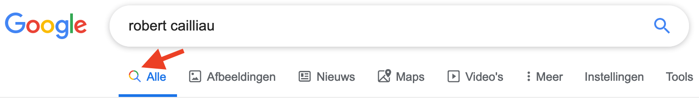
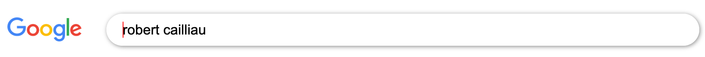

# What is this?

I built this page while running through the 'Web Development 101' course at [The Odin Project](https://www.theodinproject.com/courses/web-development-101/lessons/html-css), which I highly recommend. The end result as it currently stands can be viewed [here](https://saranoya.github.io/odin/html_css/google/search_results/). 

It is meant to be an (almost) exact visual copy of the Google search results page for 'Robert Cailliau', as viewed in a desktop browser from Belgium. Yes, that last bit is actually important. If you want to see how different the Google homepage (and especially its search results) can look when viewed from different countries, I suggest you try [OpenVPN](https://openvpn.net/community/). 

For those who do not know (which is probably most people): Robert Cailliau is a Belgian engineer who worked at [CERN](https://home.cern/) from 1974 until 2007, and while there, collaborated with [Tim Berners-Lee](https://en.wikipedia.org/wiki/Tim_Berners-Lee) on the development of the first World Wide Web. You can read more about his role in the project [on Tim Berners-Lee's personal website](https://www.w3.org/People/Berners-Lee/FAQ.html#Cailliau). 

Being from Belgium, I just couldn't resist a little bit of chauvinism in choosing the search query I would base my copy on :).   

# What I learned while working on this project

I built this page after my [copy of the Google homepage](https://github.com/Saranoya/odin/tree/master/html_css/google/homepage/), so anything I learned there may be assumed to have transferred to this project. 

## HTML

### How to create favicons that will work in all contexts

Short answer: it's rather complicated. [This CSS-tricks article](https://css-tricks.com/favicon-quiz/), though first written in 2014, explains rather well what's involved in getting favicons to display correctly everywhere. One thing is for sure: using (just) `favicon.ico` will not work on most modern browsers.

I ended up using [RealFaviconGenerator.net](https://realfavicongenerator.net/) to create the necessary source images and generate the appropriate tags for the `head` section of the page. I'm not sure this is the best solution, since it still doesn't seem to do the right thing in Safari 12 running on my local machine. But the CSS-tricks article seems to have been kept up-to-date and was last edited on January 11, 2019. So I've decided to trust it.  

## CSS 

### CSS Grid

I positioned most of the elements on this page using [CSS Grid Layout](https://css-tricks.com/snippets/css/complete-guide-grid/), my understanding of which was greatly helped by Wes Bos' [CSS Grid video tutorials](https://cssgrid.io/). I find it much easier to use and far more versatile than any other positioning technique, especially in conjunction with the [Firefox Developer Tools](https://developer.mozilla.org/en-US/docs/Tools), which (among many other useful things) let you [display grid area names](https://developer.mozilla.org/en-US/docs/Tools/Page_Inspector/How_to/Examine_grid_layouts#Display_area_names). 

I'm aware that this implies the page will not display correctly in browsers older than [Chrome 57, IE/Edge 16, Firefox 52, Safari 10 and Opera 44](https://www.w3schools.com/css/css_grid.asp). This is why I was reluctant to use it while building my [Google homepage copy](https://github.com/Saranoya/odin/tree/master/html_css/google/homepage/). However, as I found out after a bit of Googling, all currently maintained browser engines have been supporting grid layout since early 2017 or earlier. I think it's safe to assume that most people even remotely interested in this page will have a browser that can display it correctly. 

If I were working at Google, I would probably have to take into account even the people using a severely outdated browser, probably due to some kind of arcane backwards-compatibility requirement that has them using a [Trident-based](https://en.wikipedia.org/wiki/Trident_(software)) browser at work -- something even Microsoft is now [actively discouraging](https://www.telegraph.co.uk/technology/2019/02/08/stop-using-internet-explorer-warns-microsofts-security-chief/). But I don't work at Google. In fact, at this point on the learning curve, I'm barely qualified to build a non-functional visual knock-off of a single page from Google's website. So, here we are.  
 
Above all else, I learned that before I avoid using a feature described as 'new' in a tutorial video that itself may or may not be quite a few years old already, I should do a little bit of sleuthing on my own. Or in other words: [RTFMA](https://www.urbandictionary.com/define.php?term=RTFMA).

### Box-sizing: border-box

Apparently, the `box-sizing: border-box` [property](https://www.w3schools.com/css/css3_box-sizing.asp), which is set in the [CSS reset](https://necolas.github.io/normalize.css/) used in this project [because it makes (responsive) design easier](https://css-tricks.com/box-sizing/), isn't inherited by elements of type `input`. I found this out the hard way, when I struggled for quite a while to get the search field at the top of the page to fit inside its box. Things were resolved when I explicitly set `box-sizing: border-box` on the text input field. 

### The use of icon fonts

I found a great explanation on how to [create and use your own icon fonts](https://rafaltomal.com/how-to-create-and-use-your-own-icon-fonts/) with [Fontastic.me](http://fontastic.me/). Doing this allowed me to treat the icons in the navigation bar below the search field as text. They now change color along with the text, as the cursor hovers over them. However, this also means that I can't have multi-colored icons beside the active link, as Google does: 



There is probably an easy way to accomplish this while still using an icon font, but I haven't found it yet. **==TODO==** (later, maybe). 

### Box-shadow only on the bottom

It was fairly easy to make the header stick to the top of the screen as the user scrolls down. That just involved setting `position: fixed; top: 0` on the `header` element. However, once I did that, I realized that's not how Google does it.

On the Google site, when a user scrolls down far enough for the header to disappear beyond the top border of the window, a different header (of lesser height) drops down. This header has a box-shadow [on the bottom](https://stackoverflow.com/questions/4561097/css-box-shadow-bottom-only) to delineate it from the rest of the page, implemented here as follows: 

```css
box-shadow: 0 4px 2px -2px gray;
```

### Use of Unicode HTML Entities

Although it is possible to do this using [pure CSS](https://www.w3schools.com/howto/howto_css_shapes.asp), I chose to use [Unicode HTML Entities](https://unicode-table.com/en/) to represent the downward-pointing triangle next to each URL, as well as the bullet to the left of the location at the bottom of the page. This is a far simpler approach, requiring far fewer lines of code than the CSS approach, and these characters are used commonly enough to be rendered correctly in most fonts.  

### Underlining only part of a link on hover

I spent a fair amount of time looking for the right answer on this one. Finally, [this Stackoverflow answer](https://stackoverflow.com/questions/10841545/underline-part-of-hyperlink-on-hover) led me in the right direction. The key is to isolate the main part of a link (which is to be underlined on hover) and its sublink (in this case, the dark green url portion) into their own span-level elements, and then apply different text-decoration styles to them: 

```css
a:hover span.underline {
    text-decoration: underline;
}

a:hover cite {
    text-decoration: none;
}
```

## Javascript

### Move the cursor to the end of an input field

On pageload, focus is automically set on the search field. That's in line with the real Google's behavior. Since I wanted to simulate a Google search for 'Robert Cailliau', I also pre-populated that field with his name. By default, the end result of that looks like this: 



Autofocus will place the caret at the beginning of the text field, regardless of whether there's already any text in it. That's the correct behavior in most cases, because the preset value of a text input field is usually just a label, which suggests what the user might want to replace it with. But in this very particular case, it looks a little weird. 

One way to address this would be to set `caret-color: transparent` on the search input field, thereby making the caret 'disappear'. This has the added benefit of making it quite obvious that the page is not actually functional, the better to avoid confusion with the 'real' Google.

The better way is to [use JavaScript](https://css-tricks.com/snippets/javascript/move-cursor-to-end-of-input/):

```javascript
function moveCursorToEnd(el) {
    if (typeof el.selectionStart == "number") {
        el.selectionStart = el.selectionEnd = el.value.length;
    } else if (typeof el.createTextRange != "undefined") {
        el.focus();
        var range = el.createTextRange();
        range.collapse(false);
        range.select();
    }
}
```


  