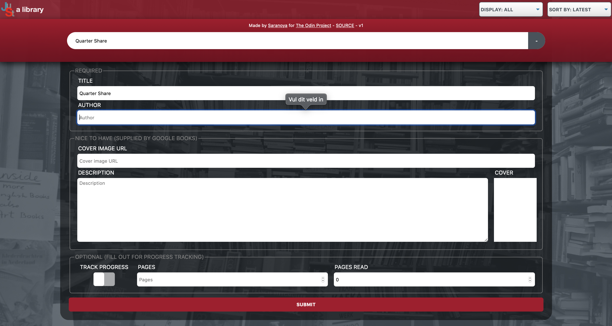

# What is this? 

This is a project I created while going through [The Odin Project's JavaScript Course](https://www.theodinproject.com/courses/javascript). I wholeheartedly recommend The Odin Project as a whole to anyone who wants to get serious about learning to program for the web. 

The finished product as it currently stands can be viewed [here](https://saranoya.github.io/odin/javascript/library/). 

# New things I learned

Before embarking on TOP's JavaScript course, I'd already completed their [Web Development 101 primer](https://www.theodinproject.com/courses/web-development-101), which includes a little bit of everything you need to be a web developer, and had already given me the opportunity to complete a few worthwile HTML/CSS/JavaScript projects, such as [an Etch-a-Sketch clone / pixelart editor](https://saranoya.github.io/odin/javascript/etch_a_sketch/), an electronic [calculator](https:// saranoya.github.io/odin/javascript/calculator/), and a [Pomodoro timer](https://saranoya.github.io/odin/javascript/pomodoro/). While I wouldn't necessarily say they represent the best of my current understanding, code for all of those projects can be found in my [odin repository on GitHub](https://github.com/Saranoya/odin). All of the JavaScript and HTML / CSS projects on there have their own README files to explain in more detail what I learned from doing them. Whatever I did learn can be assumed to have transferred to this project. But even with that, coding this library still moved the boundaries of my knowledge and skills quite a bit. 

## HTML

### Preventing a form from reloading the page on submit

When constructing the new book submissions form, the first big problem I ran into was that when I hit enter inadvertently when filling out the form, it would reload the page. Not only would that prevent a new book from actually being added to the library, but before I'd implemented any kind of persistent storage, whatever data I'd filled out so far would also be gone. Which made the app effectively unusable. 

The solution to this frustrating problem turned out to be quite simple: 

```html
<form id="add-new-book", onsubmit="return false">
...
</form>
```

### Why a 'real' submit button is indispensable

After being thwarted quite a few times in my efforts to test my app by the aforementioned problem, I was *almost* tempted to replace the form submit button with just an input element of type button. However, the real advantages I discovered after first having used the button of type submit made me persist in finding a solution that didn't involve 'abusing' the input element for purposes it wasn't meant to serve. 

Using a 'real' submit button comes with all sorts of 'free' functionality, such as 'automatic' input validation on input fields that have a specified data type (e.g. `<number>`), `min` and/or `max`, `minlength` and/or `maxlength`, or a `required` attribute. And what's more: that even happens in the user's system language! 



### Preventing automatic rescaling when focused on an input field on mobile 

On reflection, I think I stumbled upon something like this once before in the [Rock, paper, scissors project](https://github.com/Saranoya/odin/tree/master/javascript/rock_paper_scissors). However, I was 
dumb enough not to document it there, and due to the 8-month gap between my completion of that project and the resumption of my learning after a health crisis and a pregnancy, I had forgotten all about it, until a [kind tester](https://github.com/aaron-contreras) on The Odin Project's Discord server pointed out it was kind of annoying that his phone kept zooming in on input fields automatically as they gained focus, while the responsive design of the page made sure they were already quite legible without zooming. The solution was adding a single parameter to the `viewport` meta tag in the HTML: 

```html
<meta name="viewport" content="width=device-width, initial-scale=1.0, maximum-scale=1.0">
````
Setting maximum-scale to 1 will preserve the user's ability to pinch-to-zoom, but prevent all automatic zooming/rescaling. Exactly what I wanted! 

## CSS

### Gradients

Truth be told, I do not fully understand yet how to create a CSS gradient, like the one behind the new book title input field on this project (see image above), from scratch on my own. But so far, I haven't had to. 

[CSS-Matic](https://www.cssmatic.com), which had been a huge help to me before in creating box shadows on the calculator and etch-a-sketch projects, came to my rescue once again with its [gradient generator](https://www.cssmatic.com/gradient-generator#'\-moz\-linear\-gradient\%28left\%2C\%20rgba\%28248\%2C80\%2C50\%2C1\%29\%200\%25\%2C\%20rgba\%28241\%2C111\%2C92\%2C1\%29\%2050\%25\%2C\%20rgba\%28246\%2C41\%2C12\%2C1\%29\%2051\%25\%2C\%20rgba\%28240\%2C47\%2C23\%2C1\%29\%2071\%25\%2C\%20rgba\%28231\%2C56\%2C39\%2C1\%29\%20100\%25\%29\%3B'). 

### Restyling an option element in a way that ensures cross-browser compatibility

Standard select boxes tend to be kind of ugly, and [cannot be styled easily using CSS](https://developer.mozilla.org/en-US/docs/Learn/Forms/Advanced_form_styling). I solved this by basically replacing the standard styling with a background image that includes a down arrow. 

### Circumventing a grid bug in Chrome

Turns out [Chrome does not (yet?) respect grid layouts inside fieldsets](https://stackoverflow.com/questions/51076747/grid-layout-on-fieldset-bug-on-chrome). I solved this the brute-force way, by wrapping the contents of form fieldsets with a grid layout in a div: 

```html
 <fieldset>
    <legend>Nice to have (supplied by Google Books)</legend>
    <div id="nice">
        <div class="warning" id="no-gbooks-warning">
            No Google Books results for this volume. You can fill
            out the rest of the form yourself, if you wish.
        </div>
        <fieldset id="cover-url">
            <legend>Cover image URL</legend>
            <input type="text" placeholder="Cover image URL"/>
        </fieldset>
        <fieldset id="description">
            <legend>Description</legend>
            <textarea placeholder="Description"></textarea>
        </fieldset>
        <fieldset id="cover">
            <legend>Cover</legend>
            <div></div>
        </fieldset> 
    </div>
</fieldset>
```

## JavaScript

### Event Delegation 

On [a previous project](https://github.com/Saranoya/odin/blob/master/javascript/etch_a_sketch/scripts/sketch.js) that also required regular (re-)rendering of a grid-like layout, I kind of clunkily assigned an EventListener to each and every individual grid cell as it was created. A [kind soul](https://github.com/I3uckwheat) on The Odin Project's Discord server pointed out to me that this is just about the *worst* way to handle event listeners, and linked me to [this article](https://www.sitepoint.com/javascript-event-delegation-is-easier-than-you-think/), which led to this: 

```javascript
function handleBookButtons(e) {
    getEventTarget(e).classList.contains('info') ? handleInfo(e)
        : getEventTarget(e).classList.contains('delete') ? handleDelete(e)
        : getEventTarget(e).classList.contains('change-pages') ? handlePagesRead(e)
        : getEventTarget(e).classList.contains('back') ? handleBack(e)
        : getEventTarget(e).classList.contains('edit') ? handleEdit(e)
        : getEventTarget(e).classList.contains('change-cover') ? handleChangeCover(e)
        : getEventTarget(e).classList.contains('read-toggle') ? handleReadToggle(e)
        : true;
}

shelf.addEventListener('click', e => handleBookButtons(e));
```

Doing it this way means I need only one event listner for the entire bookshelf and everything in it, while deciding how to handle a click based on the class of the element clicked. This preserves memory (far fewer event listeners to keep track of), and it also means that re-rendering the shelf or adding a new book doesn't require (re-)adding event listeners over and over again to each (new or re-rendered) element. 

### Fetch API requests

Working with asynchronous code was something new to me on this project, and I'm not sure I fully understand it yet, but this is the way I ended up using it to populate my new book form with Google Books data: 

```javascript
function searchGBooks(title, author) {
    if (document.getElementById('no-gbooks-warning').style.display == 'block') document.getElementById('no-gbooks-warning').style.display = 'none';
    fetch(`https://www.googleapis.com/books/v1/volumes?q=intitle:${title}+inauthor:${author}`)
        .then(function(result) { return result.json(); })
        .then(function(fetch) {        
            if (fetch.items !== undefined) {
                document.querySelector('#description textarea').textContent = fetch.items[0].volumeInfo.description;
                document.querySelector('#cover-url input').value = fetch.items[0].volumeInfo.imageLinks.thumbnail;
                document.querySelector('#pages input').value = fetch.items[0].volumeInfo.pageCount;
                document.querySelector('#pages input').focus(); setTimeout(() => document.querySelector('#cover-url input').focus(), 1);
            } else { 
                document.getElementById('no-gbooks-warning').style.display = 'block';
                return 0 
            }
    }),
    function(error) { return 0 };
}
```

The chaining of `.then` statements is a bit ugly. I'm told there's a better way to do this with `async/await`. Perhaps I will come back to this project later and re-implement it that way.   

### Using the Escape key to manipulate elements on screen

From the get-go, I knew I wanted the new book form to fold back in on itself when the user pressed the escape button. I knew that must be possible, since I had seen it in so many other places. However, when I tried assigning an event listener to listen for the Escape key to the form, all it did was exit full screen mode in my browser every time I pressed it. It took a while to find the `preventDefault()` workaround for this, as well as realize I had to assign the event listener to the window instead of the form: 

```javascript
window.addEventListener('keypress', function(e) {
    if (e.key == 'Escape' && addNewBookForm.style.display == 'grid') {
        e.preventDefault();
        hideNewBookForm();
    }
});
```

The beauty of this solution is that when the form is hidden, Escape still works as the user expects (e.g., as a way to exit full screen mode). 

### Working with localStorage

This app does not currently have a true database back-end. Instead, it uses `JSON.stringify` to write the current contents of the myLibrary array of objects to localStorage as a string, and `JSON.parse` to convert that string back into an array of generic Objects for use in the `render()` function. This is not ideal, because prototype methods written for a specific object prototype (in this case, `Book`) cannot be called on generic Objects. However, it works. 

# Ideas for the future

- I'd like to come back to this app at some point and implement a **login / user account system**, so multiple people can use it simultaneously to track their reading progress. 
- With such a system set up (or even without it), it should be possible to **query my own database for cover images / descriptions / page counts on submission of a new book**, before relying on the Google Books API.
- One good reason to try to circumvent Google Books: the **cover thumbnails it provides are smaller than the size I'm using here for book covers**. This results in distorted / blurry cover images. It is possible to query Google Books for larger images, but this requires an API key and will limit the maximum number of API requests to a 1000 per 24 hours. That's fine while just testing, or if the app has only a handful of users. It's not a solution that scales, though. 


